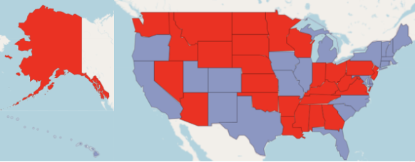
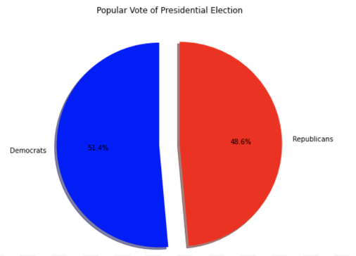
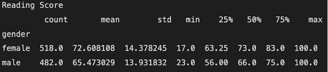
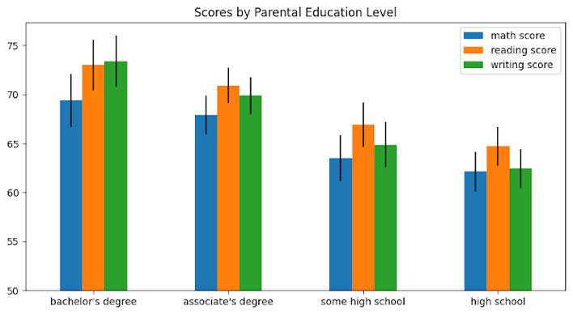

Addison Hanrattie and Sambit Sahoo  
CMSC396H  
Professor Dave Levin  
16 December 2022  

**
Measuring and Conveying Bias in Exploration
**

Bias is a common factor in data exploration that doesn't get much attention. There are several reasons for the bias, whether it stems from the data scientists being tunnel visioned, the way the data is displayed, or simply because there is missing information. Although it may not be possible to accurately detect bias during data exploration, data scientists can work toward minimizing it. Bias can be minimized by initally taking a breadth-orientated approach to data exploration. By having a higher coverage of the overall dataset, data scientists can understand the data more and decide how to continue onwards. If a data scientist were to take a depth-oriented approach first, there is a higher probability that they will begin to go down a rabbit hole and miss vital information or misrepresent the data. Another way bias can enter the data exploration is when creating visualizations for the dataset. There is the possibility that the visualization doesn't accurately represent the data. Then, these visualizations will lead people on to believe something that isn't true. It is quite difficult to create a dataset and have no bias during data exploration, so instead it would be better to investigate a dataset and create biased visualizations and end results to examine how it affects responses through a survey.

In the first dataset from Kaggle, it contained information about the presidential election of 2012. The presidential election was between Barack Obama, the candidate for the Democratic Party, and Mitt Romney, the candidate for the Republican Party. The election ended with the Barack Obama winning the electoral college: 332 to 206. This information remained hidden when asking for people's response and reasoning from their deduction from the visualizations. Using the dataset, we created two visualizations that people had to deduct responses from. The first visualization was of a map of the United States with the purpose of portraying misleading information. Based on the popular vote per state, the state would be filled in red, to represent Republicans, or blue, to represent Democrats. There were 27 states that were majority Republicans and 23 states and Washington D.C. that were majority Democrats. Based on this map visualization, people were asked who thought won the presidential election and their reasoning. From those who took the survey, 44% said Republicans would win and 56% said Democrats would win. For their reasoning, 89% of people that said the Democrats would win used the electoral college as their reasoning since states like Texas, Florida, and California were in the Democratic Party's favor. Due to their knowledge of the importance of the electoral votes, they were able to accurately deduce the winner of the election while the people that thought the Republican Party won based if off of the majority of states voting Republican. The second visualization used was a pie chart of the popular vote for the United States. This visualization was designed to make people decide with extremely limited information. The pie chart illustrated that 51.4% of people voted for Democrats and 49.6% voted for Republicans. With the limited information, 88% of people said that the Democrats won the election, while 12% said that the Republicans won. Of all the people that took the survey, only 12% mentioned that the electoral college could support or oppose their answer. The majority of the remaining people said that the pie chart suggested that the Democrats won, even if it was close. Through these two different visualizations, people used the information given as well as their own knowledge to deduce the outcome of the presidential election. Visualizations are a powerful tool to convey information and data, but can also misrepresent data if not done correctly. By creating representations that don't explicitly show vital information, the takeaways can vary from person to person.

One of human kind's most common biases is the Dunning-Kruger effect. Seeing as how simplistic data visualizations are and that most people have been making charts since the beginning of their math education in elementary school, a weak spot for bad visualizations is imprinted within us. The danger of this fault is made quite apparent through the next portion of our study, where we create visualizations from a dataset on student test performance.

The dataset obtained from Kaggle included students' scores on 3 tests of Math, Reading, and Writing along with info such as gender, race, parental education, lunch type, and test prep. After loading the data, we created two visualizations to identify how users would react to the information presented.

For the first visualization, we simply layed out the raw data since there is no way to hide extraneous information such as in the previous two examples. Thus for the reading score, we showed the mean, count, standard deviation, range, and quartile cutoffs all respective to gender. We then asked the participants "Do you think that girls did statistically significantly better than boys on the following reading scores?" This data visualization resulted in three different levels of reasonings. The first was that a participant may see the two means (72.6 girls, 65.5 boys) being different and then say girls did better simply "because they had a higher mean". This accounted for 11 of the 22 responses where participants said they only looked at the mean. Of note here is that 5 of the 11 responses referenced the standard deviations both being approximately the same as evidence along with the difference of means by saying, "[girls did better] beause the mean was larger with a similar standard deviation across both sample sets". The next level of reasoning would have participants see the means but also the standard deviation (14.4 girls, 13.9 boys) which lead some particpants to say "The stdev is too large for significance." This shows that participants had a grasp on what statistical significance calls for but not enough to identify the need to run a paired t test which was only realized by one of the participants.

When quickly reading through any piece of information the brain can easily skip over important information when it does not necessarily fit the environment. For the second education visualization we created 4 bar graphs which showed the test scores for 4 different education levels across bachelors, associates, high school, and some high school. The ordering of in terms of scores was bachelors, associates, some high school, and high school. The surprising thing is that students whose parents only had some high school did better than parents with a high school diploma. The even more surprising thing is that 8 of the 22 did not catch this point and instead said that each step of education resulted in higher scores. Also due to the open ended nature of the question "What conclusions would you draw from this chart?" some participants did not even consider the education correlation and instead looked at how each of the tests compared to each stating, "Math is statistically more challenging." This goes to show that when displaying data to a person it is very easy for them to read over or misinterpret what is being shown.

As the results of our study show people regularly misinterpret data visualizations. While most data scientists will not set out to make these misleading visualizations and graphs on purpose one could imagine how easily it would be to throw together without thinking. The main error with each one of our visualizations is that they allowed for differing interpretations by the participants which often lead to our message only getting across to about half of them. Thus in the future it is imperative that conscientious data scientists attempt to think beforehand about the different ways their visualizations could be interpreted from a multitude of perspectives before they publish their work in any form.

**Appendix: Visualizations**

